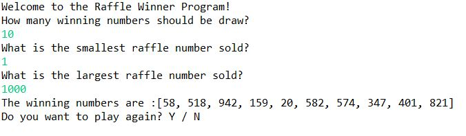

## Raffle Winners
Language: Java  
Write a class to select random winners from a range of possible winning raffle ticket numbers.

 

  

### Bonus:
Ask the user if they want to repeat and enter information for another (new) raffle. The new raffle will read in completely new information and re-draw new winning numbers.
